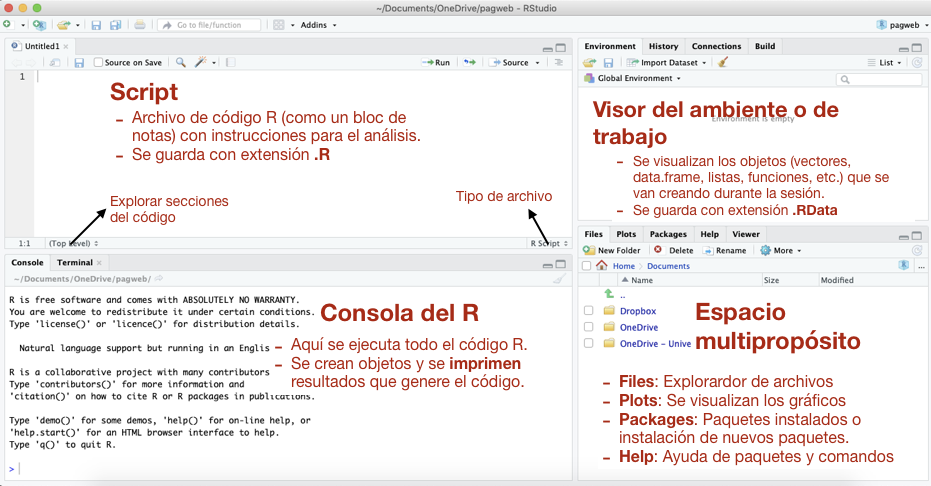

<style>
.col-izq{
  float: left;
  width: 49%;
  text-align: left;
}
.col-der{
  float: right;
  width: 49%;
  text-align: left;
}
</style>

```{r setup, include=FALSE}
library(knitr)
opts_chunk$set(fig.align = 'center', warning = F, message = F, comment = NULL)
```


***

Curso introductorio sobre el software `R` (con `Rstudio`) para análisis de datos con aplicaciones en **Epidemiología**. El material mostrado a continuación considerelo como una guía de contenidos del curso, donde se ordenan y resaltan los temas relevantes en cada sesión.

***

# Aspectos generales

## Introducción

[`R`](https://www.r-project.org/) [@rcoreteam2019] es un software de doble propósito, es un **programa** con comandos mayormente inclinados a estadística y gráficación, pero también es un **lenguaje de programación**. Algunas _características_ del `R` son:

+ Es un software libre.
+ Es un software orientado a objetos: todo en `R` es un objeto. 
+ Tiene diversas estructuras de objetos (vectores, data.frame, listas, etc.) para _almacenar_ datos haciendolo muy flexible para enfrentar necesidades de campos tan diversos como la estadística, bioinformática, sistemas de información geográfica, epidemiología, genética o ecología.
+ Un paquete es un grupo de comandos (objetos) que realizan tareas en un área específica. La distribución base del `R` viene con un conjunto predeterminado de más de 20 paquetes  (`stats`, `graphics`, `utils`, `boot`, `survival`, etc.).
+ El `R` tiene una comunidad grande y creciente de usuarios que aportan [nuevos paquetes](https://cran.r-project.org/web/packages/). A menudo, nuevos procedimientos aparecen primero para `R`.  Actualmente existen más de 14000 paquetes disponibles.
+ El uso del software se realiza a través de la escritura de código. Esto permite dejar un buen registro de los análisis realizados (investigación reproducible). No obstante, hace que el programa no sea fácil de aprender para el usuario principiante.

## Descarga e instalación de `R` y `Rstudio`

[`Rstudio`](https://www.rstudio.com/) es un _ambiente de desarrollo integrado_ (IDE, de sus siglas en ingles) o una _interface_ para trabjar con el `R` de una forma más amigable. Existen otros programas similares a `Rstudio` (p.e., [`TinnR`](https://sourceforge.net/projects/tinn-r/), [`emmacs`](https://www.gnu.org/software/emacs/), etc.), no obstante, este es uno de los más recomendados. Finalmente usaremos `R` a través de `Rstudio`.

Es recomendable instalar primero  `R` y luego  `RStudio`. La instalación de `R` no difiere de la de cualquier otro software convencial. Se [descarga](https://www.icesi.edu.co/CRAN/) un instalador para el sistema operativo correspondiente y se ejecuta. El asistente lo guiará a través de la instalación. 

Igualmente, para instalar `Rstudio`, [descargue](https://www.rstudio.com/products/rstudio/download/#download) el instalador (para el sistema operativo correspondiente) y ejecutelo. La instalación requiere permiso de administrador en el computador.

En este [documento](descargas/Guia_instalacion_software R_RStudio.pdf) se describe la descarga e instalación de  `R` y `Rstudio` con detalle.

Una vez instalado, `Rstudio` se conecta con `R` de forma automática, de manera que el usuario no debe hacer nada al respecto.

## Espacios o ventanas de `Rstudio`

`Rstudio` es una interface construida para **administrar** una sesión de trabajo con el `R`. La figura \@ref(fig:esprstudio) muestra los cuatro espacios o ventanas que tiene el programa.


```{r esprstudio, echo=F, out.width='90%', fig.cap='Espacios de `Rstudio`: Script, Consola, Visor de ambiente de trabajo y espacio multipropósito.'}
library(knitr)

```

## Mi primer análisis en `R`

A continuación realizaremos un primer análisis de datos con el objetivo de aprender los siguientes aspectos:

- **Administrar una sesión**: ejecución de código `R` en la consola; observar resultados; gráficos; crear y gestionar objetos; guardar el script, objetos, y gráficos; establecer el directorio de trabajo.
- **Sintaxis** de un comando, creación e impresión de objetos.
- Descargar, instalar y activar **librerías**.
- Recuperar y continuar con una **sesión**.

### Datos para el análisis

El análisis  lo realizaremos usando los datos del ejemplo 1.2 de @le2016 sobre un estudio **caso-control** realizado para explorar razones que explicaran una tasa de cáncer de pulmón inusualmente alta entre los residentes hombres de la costa de Georgia (EU). El factor de _exposición_ bajo estudio fue el trabajo en astilleros de barcos durante la 2da. Guerra Mundial. 

+ Los casos, sujetos con diagnóstico de cáncer de pulmón, fueron seleccionados de varios hospitales de la zona y de registros de muerte por esa causa entre 1970 y 1976. 
+ Los controles fueron seleccionados de admisiones a los mismos hospitales y del mismo período, de pacientes ingresados o muertos por causas diferentes a cáncer de pulmón, cáncer de higado, o cáncer de pulmón crónico. 

Ver @le2016 para más detalles sobre la selección de los casos y controles. También se registró el **hábito de fumar** como una variable confusora. Los datos se encuentran en el archivo de excel `cancer_astilleros.xlsx`. Además, en el script `cancer_astilleros_analisis.R` se realiza un análisis preliminar de los datos.

### Actividades {#act}

a. Cree una carpeta con un nombre alusivo al análisis que realizará. P.e., `pulmon_astilleros`.
b. Descargue los archivos [`cancer_astilleros.xlsx`](https://1drv.ms/x/s!AlLSvdV-Fwtugp0TbBXeRXjOOnr92A)  y [`cancer_astilleros_analisis.R`](https://1drv.ms/u/s!AlLSvdV-Fwtugp0P1V4t5vHnC1gP_w) y guardelos en la carpeta creada en el paso anterior.
c. Abra el `Rstudio` y establezca el **directorio de trabajo**. Para esto vaya al Menu `Session` $\rightarrow$ `Set Working Directory` $\rightarrow$ `Choose Directory ...` y seleccione la carpeta creada en el primer paso. 
d. Desde el `Rstudio` abra el script `cancer_astilleros_analisis.R`.
e. Lea el script e inicie enviando cada línea de código a la consola. Cada vez, ponga espacial atención a lo que aparece en la consola y en el visor del ambiente de trabajo.
f. Al finalizar guarde la sesión y cierre el `Rstudio`. Guardar incluye: 
    - Guardar el script.
    - Guardar el espacio de trabajo: objetos
    - Guardar las gráficas.
g. Revise la carpeta creada en el paso (a). Deben estar los archivos guardados.
h. Recupere la sesión repitiendo los pasos (c) al (g). En el paso (e) agregue nuevas líneas de código `R` que realicen los mismos cálculos para fumadores y no fumadores por separado, y ejecutelas en la consola.

## Ejercicios

```{r, include = F, eval =FALSE}
library(vcd)
write.table(x = Arthritis, file = 'descargas/Arthritis.txt', sep = '\t', 
            quote = F, row.names = F)
```


1. ¿Qué significa establecer el **directorio de trabajo**? Describa una forma de hacerlo.
1. Describa los aspectos relevantes en la **sintaxis** de un comando de `R`
1. ¿Cómo se crea o guarda un objeto? ¿Si quiere imprimir el contenido de un objeto en la consola qué debe hacer? 
2. ¿Qué es un paquete? Mencione al menos un paquete relacionado con epidemiología y de cada paquete mencione al menos un comando que le llame la atención; describa de manera breve para que sirve el comando mencionado
3. El archivo [`Arthritis.xlsx`](https://1drv.ms/x/s!AlLSvdV-Fwtugp0S62k_svp8ETm0DA) contiene los datos de un ensayo clínico doble ciego donde se investigó un nuevo tratamiento para la artritis rematoidea [@meyer2017]. Examine el archivo de excel (metadatos) para una descripción de las variables. Suponga que usted realizará un análisis de estos datos donde comparará la respuesta (`improved`) entre los dos tratamientos (`Placebo` y `Treated`) y para cada género (`Female` y `Male`) por separado. Tomando como ejemplo las actividades realizadas [arriba](#act), cree un nuevo script donde importe los datos, revise la estructura de los datos, ejecute un resumen descriptivo de cada variable y realice una tabla de frecuencias entre la respuesta (`improved`) y el tratamiento (`treat`). Documente su script y envíelo al correo pguzman@ces.edu.co.


# Datos y Objetos

## Tipos de datos

`R` maneja diferentes **tipos** de datos:

- `numeric` (o `double`): números con decimales. El separador decimal es el punto (independiente de la configuración regional del equipo).
- `integer`: números enteros (ocupan menos espacio de memoria que `numeric`), pero igualmente son números. La diferencia entre `numeric` e `integer` es sutil y para efectos del curso no es importante.
- `logic`: Verdadero (`TRUE` o `T`) o Falso (`FALSE` o `F`). Resultan de evaluar expresiones lógicas tales como $x > 5$. Cuando se realizan sumas con datos lógicos, el `TRUE` se convierte en 1 y el `FALSE` en 0. Esto es útil para realizar **conteos** de eventos.
- `character`: Texto. Para escribirlo, debe ponerse entre comillas. Sirve para representar variables categóricas.
- `Date`: Datos de fecha. El formato por defecto es aaaa-mm-dd entre comillas.
- `NA`: Indica un dato perdido.
- `NaN`: Aparece cuando un cálculo no se puede realizar. Por ejemplo $\sqrt{-2}$ o $0/0$.
- `Inf`: Aparece cuando un cálculo tiende a infinito. Por ejemplo $10/0$.
- `NULL`: Aparece cuando un atributo no existe para un objeto.

Algunos ejemplos de estos **tipos** de datos se veran a continuación. Cualquiera de estos **tipos** de datos es suceptible de almacenarse en **objetos** tales como vectores, matrices, data.frame y listas.

## Tipos de Objetos

### Vectores

Un vector es el tipo de objeto más sencillo, pero es la base para formar objetos más complejos como matrices, data.frame y listas. Además muchos argumentos de comandos reciben vectores.

Un vector permite almacenar datos de **un sólo** tipo (p.e., sólo `numeric` o sólo `logic`). Un vector se crea con el comando `c` (de concatenar). Algunos ejemplos creando vectores son (se omite la impresión):


```{r, results='hide'}
# vector numerico con un dato perdido
x <- c(40, 22, NA, 29.89)
x
# vector character
y <- c('si', 'si', 'no', 'no')
y
# vector logico
z <- c(T, F, T, F) 
z
```

#### Obteniendo información de un vector

Suponga que `x` es el siguiente vector numérico:

```{r}
x <- c(34, 24.5, 49.8, 34.5, 56.7, 23.4)
```

Algunos comandos para obtener información de un vector son los siguientes (se omite el resultado):

```{r, results='hide'}
length(x)        # longitud de x (nro. de datos en x)
typeof(x)        # tipo de datos en x
is.vector(x)     # x es un vector?
is.numeric(x)    # x es numerico?
is.character(x)  # x es character?
sum(x)           # suma de los valores en x
mean(x)          # media de los valores en x
var(x)           # varianza de los valores en x
sd(x)            # desv. estandar de los valores en x
summary(x)       # resumen de los valores en x
quantile(x)      # cuantiles de los valores en x
IQR(x)           # rango intercuartilico de los valores en x
unique(x)        # se generan los valores unicos de un vector
table(x)         # frecuencia (conteo) de cada valor unico en un vector
sort(x)          # devuleve el vector ordenado decreciente (por defecto)
sample(x)        # devuelve el vector desordenado aletoriamente
```

#### Operaciones con vectores

`R` es un lenguaje vectorizado. Esto quiere decir que las operaciones aritméticas se aplican a cada elemento del vector automaticamente, sin necesidad de aplicar un ciclo a tráves del vector. Aquí algunos ejemplos (se omite la impresión):


```{r, results='hide'}
x <- c(10, 20, 30)      # se crea un vector numerico 
x + 5                   # suma 5 a cada elemento de x
x + x    # sumando dos vectores, elemento a elemento
2*x      # multiplicando por 2 cada elemento de x
log(x)   # log natural de cada elemento de x
log10(x) # log en base 10 de cada elemento de x
sqrt(x)  # raiz cuadrada de cada elemento de x
x^2      # elevado a la 2 cada elemento de x
x^(1/4)  # elevado a la 1/4 (= raiz cuarta)
exp(x)   # exponencial x de cada elemento de x
```

#### Comandos útiles para crear vectores

La expresión `:` y los comandos `seq`, `rep` y `paste` son útiles para crear vectores con secuencias de números y texto. A continuación algunos ejemplos de su uso (se omite el resultado).

```{r, results='hide'}
# Vector con secuencia de 1 en 1
10:20

# Creando vector con secuencia personalizada
seq(from = 10, to = 40, by = 10)

# Vector con patrones de repeticion:
rep(x = 4, each = 5)            # repite el 4 cinco veces
rep(x = c(4,3), each  = 5)      # repite el 4 y 3 cinco veces
rep(x = c(4,3), times = 5)      # repite el 4 y 3 cinco veces
rep(x = c('a', 'b'), times = 5) # repite la 'a' y 'b' cinco veces

# Pegar texto:
paste('Hello', c('R', 'spss'), sep = ' ')
```


Los comandos `runif`, `rnorm`, `rbinom` y `rpois` generan vectores de números aleatorios desde los modelos de probabilidad _uniforme_, _normal_, _binomial_ y _poisson_ respectivamente. Son últiles para simular la generación de una muestra aleatoria de valores (Nota: la generación de números aleatorios desde un modelo de probabilidad es la base de los métodos monte carlo y bootstrap). Por ejemplo, a continuación se genera una muestra aleatoria de un modelo normal con media 50 ($\mu = 50$) y desviación estándar 10 ($\sigma = 10$).

```{r}
# Se generan 10 numeros aleatorios desde una poblacion
# normal con media 50 y de 10
datos_norm <- rnorm(n = 10, mean = 50, sd = 10)
datos_norm
```


### Factores

Un `factor` es similar a un vector de texto (`character`). Sin embargo, un `factor` reconoce niveles o categorías de forma explícita.  Es ideal para representar variables categóricas que serán incluidas en un análisis de datos categóricos o para variables categóricas que participan en modelos tales como una regresión logística.

Un factor permite controlar el orden de las categorías, de hecho se pueden declarar factores `ordered` para variables categóricas ordinales. Además el uso de factores permite definir fácilmente contrastes entre sus niveles o establecer un nivel de referencia contra el cual se compararan los demas niveles.

Un `factor` se crea con el comando del mismo nombre. Aquí un ejemplo:

```{r}
# Se crea un vector character:
improved <- c('Marked', 'Marked', 'None', 'Some', 'Some', 'Marked')
class(improved)   # se pregunta por la clase de x
# Se convierte en un factor
improvedf <- factor(improved)  # se convierte en un factor
improvedf          # note como se imprime en la consola
```

#### Obteniendo información de un `factor`

Algunos comandos útiles para obtener información de un factor son (se omite el resultado): 

```{r, results='hide'}
is.factor(improvedf)   # se pregunta si es un factor
class(improvedf)       # la clase
levels(improvedf)      # se pregunta por los niveles del factor
summary(improvedf)     # se resumen un factor (tabla de frecuencias)
```


#### Controlando el orden de los niveles de un factor

Con el comando `factor` se puede controlar el orden de los niveles. Utilice el argumento `levels` para específicar en que orden quiere los niveles. Un ejemplo es:

```{r}
# Se convierte en factor, pero controlando el orden  de los niveles
improvedf <- factor(improved, levels = c('None', 'Some', 'Marked'))
improvedf
levels(improvedf)
```

**Advertencia**: En el argumento `levels` debe escribir los nombres de los niveles tal cual como aparecen en el vector. Si los escribe diferente, cuando `factor` haga la conversión, generará `NA`. Aquí un ejemplo donde los niveles `None` y `Marked` se escriben mal:

```{r}
# Se convierte en factor, pero controlando el orden  de los niveles
factor(improved, levels = c('none', 'Some', 'Marke'))
```


Otra forma de _reordenar_ los niveles de un `factor` es usando el comando `relevel`. Este comando permite especificar cual nivel se quiere de primero y los demas  se corren después de él. Tradicionalmente al primer nivel se le llama el **nivel de referencia** puesto que contra este se comparan los otros niveles al calcular alguna medida de efecto tal como una razón de odds o un riesgo relativo. Enseguida un ejemplo:

```{r}
relevel(improvedf, ref = 'Marked')
```

Note en la impresión que el nivel `Marked` quedo de primero. Luego en alguna pruebe de hipótesis, este será el nivel de referencia.


#### Cambiando las etiquetes de los niveles de un factor

Además, con el comando `factor` se pueden cambiar las etiquetes de los niveles del factor. Esto se hace con el argumento `labels`. Un ejemplo es:

```{r}
# Se convierte en factor, controlando el orden de los niveles
# y cambiando las etiquetes de los niveles.
improvedf <- factor(improved, levels = c('None', 'Some', 'Marked'),
                    labels = c('Ninguna', 'Alguna', 'Fuerte'))
improvedf
```


#### Conviertiendo un `factor` en `character` o `numeric`

En ocasiones queremos convertir un factor en un vector `character` o `numeric`. Aquí como hacerlo:

```{r}
improvedc <- as.character(improvedf)   # factor a character
class(improvedc)
improvedn <- as.numeric(improvedf)     # factor a numerico
class(improvedn)
```


#### Comandos que producen factores {#com.factores}

El comando `cut` permite dividir una variable numérica en intervalos (categorías), y entrega un `factor`. Por ejemplo, considere el siguiente vector numérico que representa los datos de alguna variable:

```{r}
x <- c(34, 24.5, 49.8, 34.5, 56.7, 23.4)
```

Supona que se requiere convertir esta variable numérica en categórica dividiendola en tres intervalos:

```{r}
xf <- cut(x, breaks = c(23, 27, 40, 60))
xf
class(xf)
```


### Matrices

Una matriz (`matrix`) es un arreglo de datos de **un sólo tipo** en dos dimensiones (filas y columnas). Enseguida, dos formas de crear una matriz:

```{r}
# Creando una matriz con 'matrix':
X <- matrix(data = c(10, 20, 30, 40), byrow = F, nrow = 2)
X
# Creando una matriz con 'cbind':
Y <- cbind(c(10,20), 
           c(30,40))
```

Una matriz se puede considerar como un vector al cual se le asigna una `dim`ensión:

```{r}
X <- c(10, 20, 30, 40)   # se crea un vector numerico
dim(X) <- c(2,2)         # se asigna una dimension: 2 filas, 2 columnas
X                        # observe que X ya es una matriz 
```


#### Agregando nombres de fila y de columna

Una matriz permite tener como **atributos** nombres de fila y de columna. A continuación algunas formas de asignar nombres a filas y columnas:

```{r}
# Se crea una matriz asignando nombres de columna:
Y <- cbind(w = c(10,20), 
           z = c(30,40))
Y
# Se asginan nombres de fila y columna a la matriz X:
rownames(X) <- c('A', 'B')
colnames(X) <- c('w', 'z')
X
```


#### Obteniendo información de una matriz

Algunos comandos para obtener información de un matriz son (se omite el resultado):

```{r, results='hide'}
dim(X)        # dimension de X (nro. de filas, nro. de columnas)
typeof(X)     # tipo de datos en X
rownames(X)   # nombres de fila de X
colnames(X)   # nombres de columna de X
is.matrix(X)  # X es una matriz?
class(X)      # Clase de X
```

#### Operaciones aritméticas con matrices

Al igual que con los vectores, cualquier operación aritmética se realiza elemento por elemento. Aquí un ejemplo (se omite el resultado):

```{r}
Y <-  X + 0.5  # se suma 0.5 a cada elemento de X
```

Los comandos `colSums`, `colMeans`,  `rowSums` y `rowMeans` calculan sumas y medias por columnas o por filas. Un ejemplo sería (no se imprime el resultado):

```{r, results='hide'}
colSums(X)    # totales por columna de X
colMeans(X)   # medias por columna de X
rowSums(X)    # totales por fila de X
rowMeans(X)   # medias por fila de X
```

#### Matrices y análisis de datos categóricos

Las matrices y arreglos en general permiten representar tablas de contingencia en el análisis de datos categóricos. 

En el ejemplo ejecutado [arriba](#act) sobre la asociación entre el cáncer de pulmón y el trabajo en astilleros de barcos se generó una tabla $2 \times 2$. A continuación se digitan los conteos para no fumadores:

```{r}
X <- matrix(data = c(11,50, 35, 203), ncol = 2)
rownames(X) <- c('si', 'no')
colnames(X) <- c('caso', 'control')
X
```

Se pueden realizar cálculos sobre la matriz, como por ejemplo agregar totales marginales u obtener proporciones seleccionado el denominador preferido.

```{r}
addmargins(X, margin = 1)  # adiciona una fila de total por columnas
addmargins(X, margin = 2)  # adiciona una columna de total por filas
addmargins(X)              # adiciona una fila y columna de totales
prop.table(X, margin = 1)  # proporciones dividiendo por total de filas
prop.table(X, margin = 2)  # proporciones dividiendo por total de columnas
prop.table(X)              # proporciones dividiendo por gran total
```


### Marcos de datos (data.frame)

Un `data.frame` (al igual que una matriz) almacena datos en filas y columnas. Sin embargo, en un `data.frame`, cada columna representa un vector de un tipo particular. Así un `data.frame` puede almacenar datos de diversos tipos. Un `data.frame` se puede entender, entonces, como la concatenación de vectores, cada uno con un tipo específico de datos.

Un `data.frame` es la tabla típica de base de datos donde las columnas son "variables" y las filas son los "sujetos". Supongase que para cuatro sujetos se registraron dos variables, la edad y el tipo sanguíneo:

```{r}
# Ejemplo de creacion de un data.frame:
datos <- data.frame(
  edad      = c(34,   56,  29, 40),
  tipo.sang = c('A', 'A', 'B', 'A')
)
datos
```

Note que cada vector entra a conformar una columna del `data.frame`. Cuando se leen datos usando comandos como `read.table` o `read_excel` se crean `data.frame`'s. Con las variables de texto, el comportamiento por defecto del data.frame es convertirlas a un `factor`.

```{r}
str(datos)   # estructura del objeto
```

#### `data.frame` vs. `tbl_df` (`tibble`)

Cuando importamos tablas desde excel usando el comando `read_excel` (librería `readxl`) se crea un `tbl_df` o `tibble` (en lugar de un `data.frame` exclusivo). El `tbl_df` es una clase modificada de `data.frame` que se comporta diferente en algunos aspectos. Un `tbl_df` se crea con el comando `tibble`. Primero se debe cargar la librería `tibble`:

```{r}
library(tibble)  # se activa tibble. Debe instalarse primero
```

A continuación un ejemplo comparativo entre la impresión de un `data.frame` y de un `tbl_df` (`tibble`)

<div class="col-izq">
```{r}
# data.frame
datos1 <- data.frame(
  x = c(-3.5693, 10000, 45.67),
  y = c('si', 'no', 'no')
)
datos1 # se imprime
str(datos1)
```
</div>
<div class="col-der">
```{r}
# tibble
datos2 <- tibble(
  x = c(-3.5693, 10000, 45.67),
  y = c('si', 'no', 'no')
)
datos2 # se imprime
str(datos2)
```
</div>

<br>
<br>

Note que ambos, el `data.frame` y el `tibble` se crean de la misma forma, pero difieren en como se imprimen en la consola. También difieren en que el `tibble` maneja las variables categóricas como `character` mientras que el `data.frame` las maneja como `factor`. Note además que un `tibble`, de todos modos, incluye la clase `data.frame`.

Un `tibble` se puede convertir en un `data.frame` usando el comando `as.data.frame`. Aquí un ejemplo:

```{r}
datos2.df <- as.data.frame(datos2)  # conversion de tibble a data.frame
str(datos2.df)
```


#### Obteniendo información de un `data.frame`

Algunos comandos para obtener información de un `data.frame` (o un `tibble`) son (se omite el resultado):

```{r, results='hide'}
str(datos1)      # estructura del objeto
dim(datos1)      # nro. de filas y columnas
summary(datos1)  # resumen de cada columna
names(datos1)     # imprime los nombres de columna
```


### Listas

Una lista puede almacenar cualquier tipo de objeto, incluso otras listas. Una lista se crea con el comando `list`. Aquí un ejemplo:

```{r}
# Se crea una lista con objetos creados atras
milista <- list(obj1 = x, obj2 = X, obj3 = datos1)
milista
```

#### Obteniendo información de una lista

Algunos comandos que permiten obtener información de una lista son (se omite la impresión)

```{r, results='hide'}
names(milista)  # nombres de cada objeto contenido en la lista
str(milista)    # estructura de la lista
```

#### Comandos que generan listas

Muchos comandos que realizan pruebas de hipótesis (p.e., `t.test`, `wilcox.test`,  `prop.test`, `chisq.test`, `fisher.test`, `binom.test`,  `lm`, `glm`, etc.) entregan sus resultados como **una lista**. Suponga una prueba de hipótesis donde se busca comparar dos probabilidades usando su diferencia. El comando `prop.test` realiza la prueba:

```{r}
# Se aplica el comando prop.test para comparar dos probabilidades:
res <- prop.test(x = c(40, 50), n = c(200, 200), correct = F)
res
```

El objeto `res` es una **lista** de clase `htest`. Para imprimir (y conocer) los nombres de la lista usamos `names`:

```{r}
names(res)
```

Note que la lista almacena varios objetos. Por ejemplo, si se quiere acceder al objeto llamado `conf.int` usamos la siguiente sintaxis:

```{r}
res$conf.int  # IC95% para la diferencia en las prob. poblacionales
```


### Ejercicios {#ej:objetos}

```{r, include = F}
library(MASS)
data("birthwt")
library(tidyverse)
set.seed(3290)
n <- 10
peso10 <- birthwt %>%
  mutate(bwt = round(bwt/1000, 2)) %>%
  sample_n(size = n) %>%
  select(bwt, smoke, race, ftv)

tab22 <- xtabs(~ smoke + race, data = peso10)
```


1. Para una muestra de `r n` partos, se midió el peso del bebe al nacimiento en kilogramos. Los pesos fueron: {`r peso10$bwt`} Introduzca estos datos en un vector y obtenga la media, la desviación estándar y el coeficiente de variación del peso al nacimiento.

2. A las mismas `r n` madres del ejercicio anterior se les registró la raza. En el mismo orden, los resultados fueron: {`r peso10$race`} donde 1 = blanca; 2 = afroamericana; y 3 = otra. Introduzca estos datos en un vector y conviertalo en un `factor`. Use el argumento `labels` del comando `factor` para  cambiar las etiquetas 1, 2 y 3 por el texto correspondiente. Obtenga una tabla de frecuencias del factor generado.

3. Para los mismos datos de los ejercicios (1) y (2), de las 10 madres registradas, 2 fueron de la raza 1 y no fumaron durante el embarazo; 2 fueron de la raza 1 y si fumaron durante el embarazo; una de la raza 2 no fumó y otra de la raza 2 si fumó durante el embarazo. Finalmente, 4 madres de la raza 3 no fumaron durante el embarazo y 0 madres de la raza 3 si fumaron. Entre estos conteos en una matriz. Etiquete las filas y columnas adecuadamente. Obtenga totales por fila y columna. Guarde la matriz generada.

4. Entre los datos de los ejercicios (1) y (2) en un `data.frame`. Guardelo en un objeto e imprima el `data.frame` en la consola.

5. Guarde en una lista la matriz generada en el ejercicio (3) y el data.frame generado en el ejercicio (4).

6. Guarde todos los objetos generados en los ejercicios (1) a (5) en un archivo `.RData`. Envíelo al correo pguzman@ces.edu.co.

## Expresiones lógicas

Un expresión lógica plantea una pregunta cuya respuesta es falso (`FALSE`) o verdadero (`TRUE`). En lo que sigue suponga que `x` es un vector o matriz `numeric`. Los tipos de expresiones lógicas se listan a continuación:


```{r, eval = F}
# Expresiones logicas:
x > 5             # x es mayor que 5 ?
x >= 5            # x es mayor o igual que 5 ?
x < 5             # x es menor que 5?
x <= 5            # x es menor o igual que 5?
x > 5 & x < 10    # x es mayor que 5 y menor que 10 (5 < x < 10) ?
x < 5 | x > 10    # x es menor que 5 o mayor que 10?
x == 5            # x es igual a 5?
x != 5            # x es diferente de 5?
is.na(x)          # x es un dato perdido?
```

Cuando el vector es `character` o tenemos un `factor`, expresiones lógicas típicas son:

```{r, eval=F}
x == 'a'             # x es igual que 'a'?
x != 'a'             # x es diferente de 'a'?
x == 'a' | x == 'b'  # x es igual que 'a'  o  igual que 'b'?
is.na(x)             # x es un dato perdido?

# cuales elementos de x coinciden con ser 'a' o 'b' o 'c'?
# esto es como un 'o' para mas de dos categorias.
x %in% c('a', 'b', 'c')   
```


Las expresiones lógicas sirven para **filtrar** objetos o para **contar** eventos de interés en un muestra para una variable o una combinación de variables. A continuación se indica un ejemplo sobre un vector de 100 mediciones numéricas (se omite el resultado):

```{r, results='hide'}
# Se simula una muestra aleatoria de 100 mediciones de una
# poblacion normal con media 50 y desv. estandar 10
x <- rnorm(n = 100, mean = 50, sd = 15)

# Se cuentan cuantos sujetos tienen mediciones mayores a 70
table(x > 70)   # conteo de TRUE y FALSE
sum(x > 70)     # conteo de solo TRUE
mean(x > 70)    # proporcion de TRUE
```


Los comandos `sum` y `mean` funcionan sobre un vector lógico debido a que el `TRUE` se convierte en 1 y el `FALSE` en 0. Ahora un ejemplo con una variable categórica en una muestra de 100 registros (se omite el resultado)

```{r, results='hide'}
# Se simula una muestra aleatoria de 100 registros de una
# variable categorica con cuatro categorias 
x <- sample(x = c('a', 'b', 'c', 'd'), size = 100,
            prob = c(0.2, 0.4, 0.1, 0.3), replace = T)

# Se cuentan el nro. de sujetos con valores iguales que 'a'
table(x == 'a')   # conteo de TRUE y FALSE
sum(x == 'a')     # conteo de solo TRUE
mean(x == 'a')    # proporcion de TRUE
```


### Ejercicios

1. Considere el vector de pesos al nacimiento dado en el ejercicio (1) de la sección [anterior](#ej:objetos). Usando `sum` cuente el número de partos con pesos menores 3 kg.
2. Considere el vector de raza de la madres dado en el ejercicio (2) de la sección [anterior](#ej:objetos). Usando `sum` cuente el número de madres de raza 2.


# Análisis estadístico en R

En esta sección revisaremos procedimientos convencionales de análisis estadístico tanto descriptivos o exploratorios como inferenciales. En particular estudiaremos lo siguiente:

- exploración gráfica y numérica de datos por grupo (_Comandos_: `hist`, `boxplot`, `ggplot`, `geom_boxplot`, `geom_point`, `geom_histogram`, `group_by`, `summarise`, etc.).
- evaluación del supuesto de normalidad sobre variables continuas (_Comandos_: `hist`, `qqnorm`, `ggplot2`, `geom_qq`,  `geom_histogram`,  `shapiro.test`, `ks.test`).
- Prueba $T$ para comparar medias y pruebas equivalentes no paramétricas (_Comandos_: `t.test`, `wilcox.test`, `var.test`, `leveneTest`, `bartlett.test`).
- Modelos lineales y anova (_Comandos_: `lm`, `anova`,  `Anova`,  `emmeans`, `plot`, `summary`).
- Análisis de supervivencia y regresión de Cox (_Comandos_: `Surv`, `survfit`, `plot`, `ggsurvplot`, `coxph` `summary`, `cox.zph`).
- Prueba $\chi^2$ para tablas de contingencia, cálculo y comparació = n de riesgos (Comandos: `xtabs`, `mosaic`  `chisq.test`, `prop.test`).
- Regresión logística (_Comandos_: `glm`, `predict`, `anova`)

Para todo lo que sigue usaremos las siguientes librerías principales:

```{r lib}
library(tidyverse)  # de una sola vez activa: tibble, dplyr, tidyr, ggplot2, etc.
library(car)        # para comandos sobre modelos lineales.
library(emmeans)    # obtencion de medias y contrastes desde modelos lineales
library(survival)   # para analisis de supervivencia
library(survminer)  # para usar ggplot en analisis de supervivencia
library(vcd)        # Visualizacion de datos categoricos
library(GGally)     # para comando ggcoef (grafico de coeficientes con ggplot2)
library(Epi)        # comandos para estadistica en epidemiologia
```


Para la manipulación y cálculos sobre data.frames usaremos los comandos de la librería [`dplyr`](descargas/data-wrangling-spanish.pdf) [@wickham2017] (`group_by`, `summarise`, `filter`, `gather`). Además, en algunos casos usaremos la expresión `%>%` (que se habilita cuando activamos `dplyr`) para crear **tubos** de código, en lugar de anidar comandos (introducir un comando dentro de otro). Los tubos de código son más legibles que los comandos anidados. 

La expresión `%>%` pasa el objeto a su izquierda como primer argumento del comando que esta a la derecha. Por ejemplo: `x %>% mean()` pasa el objeto `x` como primer argumento de la función `mean()` que está a la derecha. A continuación dos ejemplos de expresiones equivalentes, una versión anidada y otra versión en un tubo:

```{r, eval = F}
# Expresiones equivalentes:
mean(x)         # anidado
x %>% mean()    # en tubo

# Expresiones equivalentes:
round(mean(x), 4)           # anidado
x %>% mean() %>% round(4)   # en tubo
```

Para los gráficos usaremos principalmente la librería [`ggplot2`](descargas/ggplot2-spanish.pdf) [@wickham2016]. Esta librería permite realizar gráficos multivariados con pocas líneas de código y se ha vuelto muy popular entre los usuarios de **R**. El libro de @chang2012 se recomienda para estudiar y usar esta librería. 

Las librerías `dplyr` y `ggplot2` (junto con otras como `tidyr`) son parte de un _ecosistema_ de paquetes pensados para **data science** [@wickham2016]  y que se hace llamar `tidyverse` [@wickham2017b].

## Respuestas continuas

### Ejemplo: Agudeza visual

```{r acuity0, eval = F, include = F}
# Lectura de datos: Agudeza visual por raza y genero 
acuity <-  read.table(file = 'acuitydata.txt', header = T )

# Se genera una columna numerica desde la edad categorica
# para efectos de hacer como ejercicio la conversion contraria
acuity$age.num <- 
  sapply(acuity$age, FUN = function(x) {
    if(x == '20-29y') runif(1, 20, 29.9) else runif(1, 30, 39.9)
  }) %>% round(1)

# Se exportan los datos
write.table(
  x = select(acuity, -group, -age), 
  file = 'visualacuity.txt', quote = F, row.names = F
)
```


```{r acuity.read, include =F}
# Lectura de datos: Agudeza visual por raza y genero ----
acuity <-  read.table(file = 'visualacuity.txt', header = T )
str(acuity) # estructura
```

Los datos del archivo [`visualacuity.zip`](https://1drv.ms/u/s!AlLSvdV-FwtugqIKxUX-OwHIO0ZBJw), tomados de la sección 8.1 de @le2016, presentan la agudeza visual (`acuity`) para dos razas (`race`) de `r nrow(acuity)` australianos. Se incluye también el género (`gender`) y la edad (`age.num`). @le2016 usan estos datos para mostrar un ejemplo de un análisis de varianza factorial. La respuesta `acuity` sigue una distribución normal.

Con este ejemplo mostraremos los siguientes aspectos:

- Lectura de datos desde un archivo `txt` (en lugar de un `excel`).
- Exploración gráfica de datos por grupos usando la comandos del paquete `ggplot2`. 
- Transformación de un variable numérica en categórica usando los comandos `cut` y `mutate` (`dplyr`).
- Pruebas para comparar dos grupos con los comandos `t.test` y `wilcox.test`.
- Ejecución de un modelo lineal y análisis de varianza con los comandos `lm` y `anova`.

#### Lectura de datos

Se importan los datos y se revisa su estructura:

```{r}
<<acuity.read>>
```

Note que el comando `read.table` produce un `data.frame` en el cual las variables categóricas quedaron como `factor`. Se puede suprimir este comportamiento usando el argumento `as.is = TRUE` dentro del comando `read.table`.

Luego de la lectura de datos, es útil realizar una tabla de frecuencias de una o un par de variables categóricas:

```{r acuity.tab}
# Tabla de frecuencias de gender por race
xtabs(~ gender + race, data = acuity) %>%
  addmargins()
```

#### Exploración gráfica

En este ejemplo, la respuesta `acuity` se quiere evaluar en función de la raza (`race`), el género (`gender`) y la edad (`age.num`). A continuación un gráfico exploratorio de dispersión usando los comandos de la librería `ggplot2` para revisar la distribución de todas las variables y su relación con la respuesta `acuity`:


```{r acuity.disp, fig.width=5, fig.height=2.6}
# Usando la libreria ggplot2 para graficar un
# diagrama de dispersion de acuity por age.num, race y gender.
ggplot(acuity, aes(x = age.num, y = acuity, col = race)) + 
  geom_point() + facet_grid(~ gender) + 
  geom_smooth(method = 'lm') + labs(x = 'age (years)')
```

Note que `age.num` no parece tener una relación con `acuity`, mientras que la `race` de europeos tiende a tener valores mayores de `acuity`. Enseguida otro par de gráficos con el mismo próposito de explorar los datos, ahora sin `age.num`.


```{r acuity.box, fig.width=4, fig.height=3}
# Diagrama de puntos con un poco de ruido aleatorio 
# para evitar el 'overplotting'
ggplot(acuity, aes(x = race, y = acuity)) +
  geom_jitter(width = 0.1) + facet_grid(~ gender)

# Boxplot
ggplot(acuity, aes(x = race, y = acuity)) +
  geom_boxplot() + facet_grid(~ gender)
```


#### Resumen numérico y perfil de medias

Los boxplot de arriba sugieren que la distribución de `acuity` es más o menos simétrica. Así, se puede usar la media y la desviación estándar para resumir esta variable. No obstante, lo ideal es realizar el resumén por cada combinación de niveles de `gender` y `race`. A continuación se usa el comando `group_by` (paquete: `dplyr`) para  agrupar el data.frame `acuity` por `gender` y `race` y luego se aplica el comando `summarise` (paquete: `dplyr`) para aplicar algunas funciones de resumen.


```{r acuity.descrip}
# Resumen descriptivo usando comandos del paquete dplyr 
descrip.acuity <- acuity %>%
  group_by(race, gender) %>%     # se agrupa por race y gender
  summarise(n = n(), m = mean(acuity),       
            s = sd(acuity),
            eem = s/sqrt(n))

descrip.acuity  # se imprime el resultado
```


Note que el objeto  `descrip.acuity` contiene el resumen realizado. Este objeto contiene los resultados mostrados en la Tabla 8.1 de @le2016, además, esta tabla permite realizar un _perfil de medias_ (igual a la figura 8.1 de @le2016) para explorar con mayor detalle la posibilidad de **interacción** entre `gender` y `race`. Este gráfico se puede realizar también con `ggplot2`:


```{r acuity.perfil, fig.width=4, fig.height=3}
# Grafico de perfil de medias con barras de error:
ggplot(descrip.acuity, aes(x = gender, y = m, ymin = m-eem, ymax = m+eem,
                           col = race, shape = race)) +
  geom_pointrange(size = 1) + geom_line(aes(group = race)) + ylab('mean acuity')
```

El gráfico sugiere que el efecto de `gender` sobre `acuity` es más fuerte en `race = European` que en `race = Aboriginal` y esta modificación del efecto es indicativo de **interacción** entre `race` y `gender`. Esto se probará más adelante usando un análisis de varianza.


#### Convirtiendo una variable numérica en categórica

Los autores categorizan la edad en dos intervalos (20 a 29 y 30 a 39 años). Para hacer esto, usaremos el comado [`cut`](\#com.factores) dentro del comando `mutate` (librería `dplyr`):

```{r acuity.age1}
range(acuity$age.num)  # para ver el min y max de age.num
acuity2 <- mutate(acuity, 
    agef = cut(age.num, breaks = c(20,30,40), right = F)
  )
str(acuity2)              # observe el cambio
summary(acuity2$agef)
```

Usando el nuevo objeto `acuity2`, se puede realizar un boxplot incluyendo también la edad categórica:

```{r acuity.age2, fig.width=5, fig.height=2.5}
# Boxplot para la acuity con cuatro var categoricas
ggplot(acuity2, aes(x = race, y = acuity, fill = agef)) +
  geom_boxplot() + facet_grid(~ gender)
```

Igual que en el primer gráfico, se observa que la `agef` no parece introducir explicación adicional en la variación de `acuity`.

#### Evaluación de normalidad

Los boxplot realizados atras sugieren que la distribución de `acuity` es relativamente simétrica en cada grupo y que posiblemente tenga una distribución normal. Sin embargo otros métodos pueden usarse para realizar una evaluación más rigurosa de la normalidad.  Para este propósito, a continuación se realizan gráficos cuantil-cuantil, histogramas y la prueba Shapiro-Wilk.

Los comandos que trae el **R** de base para realizar un histograma y un gráfico cuantil-cuantil son: `hist` (paquete: `graphics`) y `qqnorm` (paquete: `stats`) respectivamente. Para ilustración, enseguida se usan estos dos comandos sobre la variable `acuity` para los `r nrow(acuity)` sujetos del estudio.


```{r acuity.hist, fig.width=6, fig.height=3}
par(mfrow = c(1,2), cex = 0.9)  # se abre la ventana grafica en dos espacios (1 fila y 2 columnas)
hist(acuity2$acuity, col = 'lightblue', xlab = 'Visual Acuity')      
qqnorm(scale(acuity2$acuity), col = 'blue', ylab = 'Visual Acuity', 
       xlim = c(-4,4), ylim = c(-4,4))
abline(a = 0, b = 1, lty = 2)  # se agrega una linea diagonal de referencia
```

El comando `scale` estandariza (($x - \bar{x})/s$) los datos antes de realizar el gráfico. Los gráficos indican que `acuity` sigue una distribución normal. La librería `ggplot2`, por otro lado, tiene los comandos `geom_qq` y `geom_histogram` para el mismo próposito. No obstante, `ggplot2` tiene facilidades que permiten realizar los mismos gráficos por grupos. A continuación se realizan los mismos gráficos usando `ggplot2`:

```{r acuity.hist.ggplot, fig.width=6, fig.height=3}
# Se hace histograma
p1 <- ggplot(acuity2, aes(x = acuity)) + 
  geom_histogram(bins = 8, col = 'brown', fill = 'lightblue')

# Se hace cuantil-cuantil
p2 <- ggplot(acuity, aes(sample = scale(acuity))) +
  geom_qq(col = 'blue') +  xlim(-4,4) + ylim(-4,4) +
  geom_abline(slope = 1, intercept = 0, lty = 2, 
              lwd = 0.5, col = 'brown')

# Se grafican juntos:
library(gridExtra)
grid.arrange(p1, p2, ncol = 2)
```

Ahora se realizan los mismos gráficos por grupos (combinaciones de `gender`, `race` y `agef`). Para el gráfico cuantil-cuantil, primero se realiza la estandarización (con `scale`) por grupo usando `group_by` y `mutate`.


```{r, fig.width=7, fig.height=3.5}
# Graficos cuantil - cuantil por grupo
acuity2 %>%
  group_by(gender, race, agef) %>%
  mutate(acuity.z = scale(acuity)) %>%   # se estandariza acuity por gender, race y agef
  ggplot(aes(sample = acuity.z)) +
  geom_qq(col = 'blue') +  xlim(-4,4) + ylim(-4,4) +
  geom_abline(slope = 1, intercept = 0, lty = 2, 
              lwd = 0.5, col = 'brown') +
  facet_grid(gender ~ agef + race)

# Histogramas por grupo
ggplot(acuity2, aes(x = acuity)) + 
  geom_histogram(bins = 8, col = 'brown', fill = 'lightblue') + 
  facet_grid(gender ~ agef + race) 
```

Los gráficos muestran evidencia razonable de normalidad para `acuity` en cada uno de los grupos de datos. 

Una prueba Shapiro-Wilk se realiza con el comando `shapiro.test`. Si se quisiera aplicar la prueba a toda la columna `acuity` (sin distinguir por grupo), el código es el siguiente:

```{r acuity.shapiro1}
res.shapiro <- shapiro.test(acuity2$acuity)
res.shapiro   # se imprime
```


Este resultado produce una `lista`. Para conocer su contenido podemos usar el comando `names`. 

```{r acuity.shapiro2}
names(res.shapiro)
```

Por ejemplo, si usted quiere obtener sólo el valor $p$ (`p.value`) se escribe el nombre de la lista, signo de moneda (`$`) y el nombre del elemento, asi:

```{r acuity.shapiro3}
res.shapiro$p.value
```

Para aplicar el mismo comando a cada grupo podemos usar de nuevo la combinación de comandos `group_by` y `summarise`. 

```{r acuity.shapiro4}
# Prueba Shapiro-Wilk sobre acuity por grupo:
acuity2 %>%
  group_by(gender, race, agef) %>%
  summarise(
    n = n(),
    valor_P = shapiro.test(acuity)$p.value
  )
```

Usando un nivel de significancia $\alpha = 0.05$, no se rechaza la hipótesis de normalidad en ninguno de los grupos.

#### Pruebas para comparar dos grupos {#t.test}

Sólo para ilustración, enseguida se realiza una prueba $T$ para comparar la media del `acuity` entre los dos niveles de `race` mediante el comando `t.test` en mujeres. Este comando recibe una `formula` (`y ~ x`) donde se indica cual es la respuesta (`y`) y cual es la variable explicativa (`x`), un argumento `data` donde debe indicarse el data.frame con los datos y, de forma opcional, el argumento `subset` donde se específica un filtro para las filas de la tabla usando una expresión lógica.


```{r acuity.t.test}
# Prueba T para Female (suponiendo varianzas diferentes)
t.test(acuity ~ race, data = acuity, subset = gender == 'Female', 
       alternative = 'two.sided', paired = F, var.equal = F)
```

El comando `wilcox.test` realiza la prueba no parámetrica $U$ de Mann-Whitney (o prueba de sumas de rangos de Wilcoxon) equivalente. Los argumentos de este comando son similares a los de `t.test`.


```{r acuity.wilcox}
# Prueba no parametrica de Wilcoxon (o Mann-Whitney) para Female:
wilcox.test(acuity ~ race, data = acuity, subset = gender == 'Female', 
       alternative = 'two.sided', paired = F, correct = F)
```

En ambos casos, el valor $p$ (`p-value`) indica evidencia fuerte en contra de la hipótesis nula de igualdad. Realice usted la prueba $T$ y de Wilcoxon para los hombres. Use `?wilcox.test` y `?t.test` para ver la ayuda y revisar el detalle de los argumentos de cada comanado.

Adicionalmente, si quiere comparar dos (o más) varianzas, se encuentran los comandos `var.test` (librería: `stats`),  `bartlett.test` (librería: `stats`) y `leveneTest` (librería: `car`). Sus argumentos son similares a los de `t.test`.

#### Modelo lineal y análisis de varianza

Para ejecutar un modelo lineal donde `acuity` se evalue en función de `race` y `gender` (o incluso `age.num` o `agef`) se usa el comando `lm`. Este comando sirve para modelos con una o más variables explicativas de diferente tipo. Otros comandos como `summary`, `anova`, `predict`, `residuals`, `confint`, `plot`, etc. están disponibles para extrear diferentes cálculos y pruebas del objeto generado por `lm`. Todos estos comandos son del paquete `stats`. Adicionalmente, el paquetes `emmeans` [@lenth2019]  tiene comandos para realizar cálculo de medias y contrastes personalizados sobre el objeto producido por `lm`. El paquete `car` [@fox2011] también es un buen acompañante para realizar cálculos sobre el objeto `lm`.

##### Ejecutando el modelo con `lm` y explorando el objeto

Con el comando `lm` podemos ajustar el siguiente modelo:

$$ \mathtt{acuity}_i = \beta_0 + \beta_1\mathtt{gender}^{m}_i + \beta_2\mathtt{race}^{e}_i + \beta_3(\mathtt{gender}^{f} \times \mathtt{race}^{e})_i + \varepsilon_i  $$

donde $\mathtt{gender}^{m}$ es $1$ si `gender` es `male` y $0$ en otro caso, y $\mathtt{race}^{e}$ es $1$ si `race` es `European` y $0$ en otro caso. Note que el nivel de referencia queda para el primer nivel de cada factor incluido en el modelo. El término $\mathtt{gender}^{f} \times \mathtt{race}^{e}$ indica la interacción entre `gender` y `race`. En `lm`, los errores o residuales ($\varepsilon_i$) se suponen normales con media $0$ y varianza $\sigma^2$.

Similar a comandos como `t.test`, `wilcox.test` o `var.test` (ver [atras](\#t.test)), el comando `lm` recibe los argumentos: `formula`, `data` y `subset` (opcional).


```{r acuity.lm, echo=-6}
# Se ejecuta un modelo lineal usando lm:
m <- lm(acuity ~  gender + race + gender:race, data = acuity2)   # forma larga
m <- lm(acuity ~  gender*race, data = acuity2)                   # forma corta
class(m)  # examine la clase del objeto
m         # imprima el objeto
betas <- round(coef(m),3)
```

La impresión nos ofrece la estimación de los coeficientes del modelo ($\hat{\beta}_0 = `r betas[1]`, \hat{\beta}_1 = `r betas[2]`, \hat{\beta}_2 = `r betas[3]`, \hat{\beta}_3 = `r betas[4]`$).

El objeto `m` es una **lista** de clase `lm`. Para ver el contenido de esta lista usamos `names`:

```{r}
names(m)
```

Para extraer cualquier de estos objetos usamos el nombre de la lista, el signo de moneda (`$`) y el nombre del objeto. Por ejemplo, si usted quiere extraer los coeficientes:

```{r}
m$coefficients   # tambien sirve m$coef o coef(m)
```

##### Evaluando supuestos y diagnósticos

El comando `plot` sobre el objeto de clase `lm` imprime seis gráficos de diagnóstico. De estos seis se muestran tres a continuación:

```{r acuity.lm.plot, fig.width=8, fig.height=3.5}
par(mfrow = c(1,3), cex = 0.9)  # se divide la ventana en 3 (1 fila y 3 col)
plot(m, which = 1)   # residuales vs. ajustados
plot(m, which = 2)   # qqnorm de resiudales estandarizados
plot(m, which = 4)   # distancia de cook (valores influenciales)
```


##### Análisis de varianza

El comando `anova` imprime un análisis de varianza con pruebas (o sumas de cuadrado) secuenciales (tipo I en la jerga del programa SAS):

```{r acuity.anova}
# Anova tipo 1 o secuencial
anova(m)
```

Si se quiere obtener las anovas tipo 2 y 3 use el comando `Anova` (paquete: `car`)

```{r acuity.Anova}
library(car)
Anova(m, type = 2)   # Anova tipo 2
Anova(m, type = 3)   # Anova tipo 3
```


##### Coeficientes y prueba sobre los coeficientes

Para imprimir una tabla con coeficientes, errores estándar y pruebas sobre los coeficientes del modelo use el comando `summary`

```{r acuity.lm.sum}
# resumen de los ppales aspectos del modelo
summary(m)   
```

La parte final de la salida del `summary` muestra estadísticos útiles como el coeficiente de determinación ($R^2$) y el coef. de determinación ajustado. 


El comando `confint` imprime adicionalmente intervalos de confianza para los coeficientes del modelo:

```{r}
# Se imprimen IC95% para los coeficientes
confint(m)
```

Usted podría juntar en un mismo objeto la tabla de coeficientes generada por `summary` y la tabla de IC95% generada por `confint` usando el comando `cbind` (unir o pegar por columnas):

```{r}
# Se juntan tabla de coeficientes con sus IC95%
cbind(
  summary(m)$coef,
  confint(m)
) %>% round(4)
```

No obstante, el comando `ci.lin` de la librería `Epi` hace lo mismo por defecto:

```{r}
# Impresion de tabla de coef e IC95% juntos:
library(Epi)
ci.lin( m ) %>% round(4)
```


Finalmente, se pueden gráficar los coeficientes junto con IC95% usando el comando `ggcoef` (librería: `GGally`):

```{r, fig.width=5.46, fig.height=3.41}
library(GGally)
ggcoef(m)   # se crea el grafico
```

##### Cambiando niveles de referencia

Si se quiere cambiar un nivel de referencia lo puede hacer con `factor` o con el comando `relevel`. Puede usar `mutate` para aplicar cualquiera de estos comandos a la columna respectiva del data.frame:

```{r acuity.lm.gender}
# Se crea otro data.frame donde gender tiene como nivel 
# de referencia a Male:
acuity3 <- mutate(acuity2,
  gender = relevel(gender, ref = 'Male')
  )

# Se ejecuta el modelo de nuevo:
m <- lm(acuity ~ gender*race, data = acuity3)
round(m$coef, 4)  # se imprimen los coeficientes
```


##### Comparando modelos

Suponga que usted quiere evaluar si la edad tiene un efecto sobre `acuity` (ejemplo 8.2 de @le2016). Se puede ejecutar un nuevo modelo que incluya la edad y utilizar el comando `anova` para comparar los dos modelos. Esto devuelve una prueba $F$ que compara el modelo completo (que incluye la edad) con uno reducido (que no incluya la edad). La comparación se realiza en términos de la **reducción** en la suma de cuadrados del error que ocurre del modelo reducido al modelo completo.

```{r acuity.comp.mod} 
# Nuevo modelo con la edad:
m.agef <- lm(acuity ~ gender*agef*race, data = acuity3)

# Comparacion de modelos:
anova(m, m.agef)
```


##### Estimando medias y efectos (contrastes)

Desde el objeto `lm` se pueden solicitar estimación de medias y efectos (diferencias de medias) con una variedad de opciones. Para esto es últil la librería `emmeans`. A continuación se solicitan las medias de `acuity` por `race` para cada `gender`, y además, se calculan contrastes (diferencias) entre las medias de `acuity` en cada `gender`.

```{r acuity.emmeans}
# Medias de raza por genero y diferencias entre 
# razas dentro de genero
emmeans(m, specs = ~ gender | race, contr = 'pairwise')
```

La salida de `emmeans` se divide en dos partes. Al inicio muestra las medias (`$emmeans`) de `gender` en cada nivel de `race`. Al final muestra los contrastes (`$contrasts`) o diferentes entre los niveles de `gender` para cada `race`. En `Aboriginal` note que la diferencia resultó positiva y no significativa (valor $p = 0.7945$), mientras que `European` resultó negativa y significativa (valor $p = 0.0083$). Por esta razón, la **interacción** tuvo significancia en el modelo.

El comando `ci.lin` (paquete: `Epi`) también permite  solicitar contrastes entre niveles de un factor en un modelo `lm`.


### Ejemplo: Supervivencia en cáncer de ovario

El objeto `ovarian` (paquete: `survival`) en **R** contiene los datos de un ensayo aleatorizado de cohorte donde se comparan dos tratamientos contra el cáncer de ovario. Usaremos estos datos para ilustrar algunos aspectos del análisis de supervivencia en **R** tales como estimación Kaplan-Meier, curvas de supervivencia y regresión de Cox. Un script inicial para estos datos se puede descargar [aquí](https://1drv.ms/u/s!AlLSvdV-FwtugqIMox_cc4NLYEmwkw).

En este [enlace](https://rstudio-pubs-static.s3.amazonaws.com/375297_34390ade0ddb4dd2bbe3bf1abf884dfe.html) podrá encontrar mayor detalle sobre análisis de supervivencia y regresión de Cox en **R**. También dos libros recomandos de análisis de supervivencia en `R` son el de @tableman2003 y el de @brostrom2012.

#### Lectura de datos

Los datos ya se encuentran en **R**. Sólo debe activarse el paquete `survival` y luego los datos con el comando `data`:

```{r ova.read}
library(survival)  # se activa survival
data("ovarian")    # se activa el data.frame ovarian

# Se revisa la estructura
str(ovarian)

# Resumen del data.frame
summary(ovarian)
```

La variable `funtime` indica el tiempo de falla (muerte) o censura, mientras que `funstat` indica si ocurrió censura (`0`) o no (`1`). Note que el $100 - 46.2 = 53.8$%  de la muestra tuvo censura.  Las otras variables son la edad del sujeto (`age`), si tenía una enfermedad resiudal (`resid.ds`), el grupo tratamiento (`rx`) y el estatus de ECOG (`ecog.ps`, donde `1` es mejor). Ver la ayuda de `ovarian` para más detalles.

#### Variables numéricas a `factor`

Note en el resumen anterior, que las variables `resid.ds`, `rx` y `ecog.ps` son categóricas. Dado que los análisis que se realizarán enseguida permiten trabajar con estas variables como `factor`es, a continuación se convierten en factores usando `factor` dentro de `mutate`:

```{r ova.factor}
# Se convierten en factor algunas variables creandose
# otro data.frame:
ovarianf <- mutate(ovarian,
      resid.ds = factor(resid.ds, labels = c('no', 'yes')),
      rx = factor(rx, labels = c('A', 'B')),
      ecog.ps = factor(ecog.ps, levels = c(1,2), labels = c('good', 'bad')),
      agef = factor(ifelse(age > 50, 'old', 'young'))
    )
str(ovarianf)
```


#### Estimando la función de supervivencia

El comando `survfit` (paquete: `survival`) permite estimar la función de supervivencia usando Kaplan-Meier. Igual que  `lm`, el comando `survfit` recibe tres argumentos principales: `formula`, `data` y opcionalmente un `subset`. 

La `formula` tiene la forma: `Surv(time, event) ~ x`, donde el comando `Surv` crea un objeto de supervivencia para la respuesta a partir de argumento para la tiempo (`time`) de falla y otro para el tipo de evento ocurrido (`event`, censura o no). Vease la ayuda de `Surv` para más opciones. El término `x` en la fórmula indica la variable explicativa.

Enseguida se ejecuta `survfit` sobre `ovarianf`:

```{r ova.univar0}
# Analisis univariado (sin variable explicativa)
m <- survfit( Surv(time = futime, event = fustat, type = 'right') ~ 1, data = ovarianf)

# Lo mismo pero usando opciones por defecto
m <- survfit( Surv(futime, fustat) ~ 1, data = ovarianf )  
```

El objeto `m` es una **lista** de clase `survfit`. Para explorar su contenido usamos `names`:

```{r}
names(m)  # elementos de la lista
```


Para obtener una tabla con la estimación de la función de supervivencia podemos usar `summary`, similar a las mostradas en la sección 5.4 de @woodward2014:


```{r ova.univar1}
# Tabla con estimacion de supervivencia Kaplan-Meier
summary(m)
```

Para graficar la curva de supervivencia Kaplan-Meier usamos `plot` o el comando `ggsurvplot` (paquete: `survminer`):

```{r ova.univar2, fig.width=4, fig.height=4}
# Grafico con estimacion Kaplan-Meier
plot(m, xlab = 'Tiempo', ylab = 'Prob of survival', col = 'blue',
     mark.time = T) 
```


```{r ova.univar3, fig.width=3, fig.height=3}
# Grafico con estimacion Kaplan-Meier usando ggsurvplot:
library(survminer)
ggsurvplot(fit = m, censor = T)
```


#### Estimando la supervivencia a un tiempo $x$

Una cantidad de interés en el análisis de supervivencia es la probabilidad de sobrevir a cierto tiempo $x$. Esta estimación puede realizarse usando el comando `summary` con el argumento `times`:

```{r ova.univar4}
# Prob. de sobrevivencia en time = 300
summary(m, time = 300)
```

Note que si sólo se imprime el objeto `m` (de clase `survfit`), aparece la estimación del tiempo _mediano_ de supervivencia:

```{r}
m   # Impresion del objeto. Aparece estimacion para el tiempo mediano
```

El tiempo mediano fue 638. Compare este resultado con el gráfico anterior. Coincide.

#### Comparando dos grupos

Suponga ahora que se desea comparar los tiempos de supervivencia entre los tratamientos A y B (variable `rx`). A continuación se ajusta un nuevo modelo con `survfit`:

```{r}
m1 <- survfit( Surv(futime, fustat) ~ rx, data = ovarianf )
m1
```

La prueba **long-rank** [@woodward2014, sección 5.5.2] para comparar dos curvas de supervivencia se puede realizar con el comando `survdiff` (paquete: `survival`):

```{r}
# Prueba Long-Rank (no parametrica) para comparar dos curvas
# de supervivencia:
survdiff(Surv(futime, fustat) ~ rx, data = ovarianf, rho = 0 )
```

Además, un gráfico para los dos grupos, con `ggsurvplot`, es:

```{r, fig.width=4, fig.height=5}
# Grafico usando ggsurvplot:
ggsurvplot(fit = m1, censor = T, pval = T, risk.table = T)
```

El valor $p = 0.3$ que se indica en el gráfico es el valor $p$ de la prueba long-rank mostrada arriba. Note que la supervivencia del grupo B parece ser mayor que la del grupo A, no obstante, con $\alpha = 0.05$, se retiene la hipótesis nula de igualdad. 

#### Regresión de Cox

##### Ajustando el modelo

Si se busca evaluar simultaneamente más de una variable explicativa, la regresión de Cox es una opción. Este es un modelo semi-paramétrico que supone hazards proporcionales. Siguiendo la notación de @woodward2014, el modelo de regresión de Cox se puede escribir como:

$$ \log{\phi} = \beta_1 x_1 + \beta_2 x_2 + \cdots + \beta_k x_k \ , \quad \text{ donde } \quad \phi = \dfrac{h_j(t)}{h_0(t)} $$
y $h_j(t)/h_0(t)$ es la razón de hazards que compara el hazard de fallar (muerte) cuando se esta expuesto al $j-$ésimo nivel de las variables $x_1, x_2, \ldots, x_k$ contra el hazard de fallar cuando se esta expuesto al primer nivel o de referencia de las variables $x_1, x_2, \ldots, x_k$.

El modelo se ajusta en **R** con el comando `coxph` (paquete: `survival`). Sus argumentos principales son los mismos que aquellos en `survfit`.

Enseguida se ejecuta un modelo de Cox incluyendo `rx`, `resid.ds` y `agef` como variables explicativas:

```{r}
# Ejecucion de modelo de Cox:
m.cox <- coxph(Surv(futime, fustat) ~ rx + resid.ds + agef + ecog.ps, 
               data = ovarianf)
```


##### Explorando el modelo ajustado

Como es usual, el comando `summary` imprime un resumen de los coeficientes del modelo incluyendo valores $p$ e intervalos de confianza para los coeficientes:


```{r}
# Resumen del modelo de Cox:
summary(m.cox)
```

Este mismo resumen se puede explorar de forma gráfica usando un diagrama de **Forest** (como los usados en metanalisis). Este diagrama lo hace el comando `ggforest` (paquete: `survminer`):

```{r ova.forest, fig.width=4.9, fig.height=4.77}
# Diagrama de Forest para el modelo de Cox
ggforest(m.cox, data = ovarianf)
```
 

En la parte inferior de la impresión del `summary(m.cox)` se imprime una prueba razón de verosimilitud sobre la significancia general del modelo. Por otro lado, la razón de hazard ($h_j(t)/h_0(t)$, en su escala original) se indica en la columna `exp(coef)` y un intervalo de confianza del 95% se indica en las columnas  `lower .95` `upper .95` respectivamente. Una prueba $Z$ (de Wald) sobre la significancia de cada coeficiente se indica en las columnas `z` `Pr(>|z|)`.

Los resultados indican que, luego de ajustar por las otras variables en el modelo, la variable `rx` tiende a reducir el riesgo (hazard) de morir con el tratamiento B (sobre el A) de forma significativa ($\hat{\phi} = 0.25$, valor $p = 0.032$); los individuos `young` (menores a 50 años) tienen un hazard significativamente más bajo ($\hat{\phi} = 0.11$, valor $p = 0.047$) que aquellos mayores, y tener `resid.ds` incrementa el hazard de morir ($\hat{\phi} = 4.25$, valor $p = 0.047$). Finalmente, la variable `ecog.ps` resultó sin significancia estadística.


##### Supuesto de hazards proporcionales

El comando `cox.zph` (paquete: `survival`) evalua la asunción de hazards proporcionales de la regresión de Cox.

```{r}
# Evaluacion de la asuncion de hazards proporcionales
cox.zph(m.cox)
```

La impresión de `cox.zph` muestra, para cada variable explicativa, una prueba sobre la correlación entre el tiempo de supervivencia transformado y los residuales de Schoenfeld. La columna `rho` indica la correlación, y las columnas `chisq` y `p` indican una prueba de hipótesis sobre la correlación. La ausencia de correlación (no rechazo de la hipótesis nula) indica una validación del supuesto de hazards proporcionales. Para este caso, un $\alpha = 0.05$ se retiene la hipótesis nula y se valida el supuesto de hazard proporcionales.

## Respuesta dicotómica


```{r truchas0, include = F}
load("truchas.RData")  # se saca de carpeta 'datos'
save(x = truchas, file = 'truchas.RData')  # se escribe en wd
```

El archivo [truchas.zip](https://1drv.ms/u/s!AlLSvdV-FwtugqIJe9d3kOkP-TntqQ) continen los datos de la ocurrencia de una infección bacteriana (`bacteria`) en `r nrow(truchas)` truchas pescadas de tres estaciones (`est`) diferentes y en dos épocas (`epoca`: `0` = Seca y `1` = lluviosa) del año. Además, a cada individuo colectado, se le registró la talla (`talla` en mm). Este conjunto de datos será utilizado para ilustrar algunas técnicas de análisis de datos categóricos (tablas de contingencia, pruebas chi-cuadrado, etc.) incluyendo regresión logística. Se recomienda el libro de @bilder2014 para una presentación detallada de análisis de datos categóricos con **R**.

### Lectura de datos

Los datos se encuentran en un archivo `.RData`. El comando `load` permite cargar al espacio de trabajo un archivo de este tipo:

```{r truchas1}
# Lectura de datos
load("truchas.RData")  # Se cargan los datos al espacio de trabajo
str(truchas)           # estructura del objeto
summary(truchas)       # resumen del objeto
```

Enseguida se cambian las etiquetas de los niveles de `epoca` y se propone una categorización para la talla:

```{r truchas2}
# Se cambian las etiquetas de epoca y se categoriza la talla en
# en tres intervalos:
truchasf <- mutate(truchas,
  epoca = factor(epoca, labels = c('seca', 'lluviosa')),
  tallaf = cut(talla, breaks = c(5, 28, 35, 55))
)

# Resumen del data.frame:
summary(truchasf)

# Tabla de frecuencias plana
ftable(tallaf ~ est +  epoca, data = truchasf)
```

Se encontró una prevalencia general de la infección de 25.9%, además las variables `est`, `epoca` y `tallaf` estan distribuidas más o menos uniformemente entre sus respectivas categorías.

### Exploración gráfica

Con estos datos se busca analizar la respuesta `bacteria` en función de la `talla` (o `tallaf`), la `est` y la `epoca`. A continuación se realiza un gráfico de dispersión entre `bacteria` y `talla` para cada nivel de `est` y `epoca` usando `ggplot2`:

```{r, fig.width=6.18, fig.height=2.68}
# diagrama de dispersion
ggplot(truchasf, aes(x = talla, y = bacteria, col = epoca, 
                     shape = epoca)) +
  geom_jitter(height = 0.05, size = 2) + facet_grid(~ est)
```

Este gráfico no es muy claro, pero se nota que hay más puntos verdes (época lluviosa) para truchas infectadas, además hay más puntos infectados en tallas pequeñas y más puntos infectados en la estación c.

Un gráfico de mosaico desde la librería `vcd` permite dar otra mirada a este conjunto de datos.

```{r, fig.width=6.18, fig.height=4}
# Tabla de conteos (array) de cuatro dimensiones:
tab <- xtabs(~ bacteria + est + epoca + tallaf, data = truchasf)

library(vcd)  # Para grafico de mosico
mosaic( tab, condvars = c(3,4), main = "Gráfico de Mosaico")
```


Otra versión del gráfico de mosaico es la siguiente:

```{r, fig.width=6.18, fig.height=4}
mosaic( tab, condvars = c(3,4), shade = T, highlighting = "bacteria",
  highlighting_fill = c("grey70","salmon"), main = "Gráfico de Mosaico")
```

Note que la infección aumenta hacia la estación c, es más frecuente en tallas pequeñas y en época lluviosa.

### Resumen numérico: agregando la tabla original {#resnum}

Para una respuesta dicotómica como es el caso de este ejemplo, el resumen numérico ideal es el conteo del evento de interés o número de éxitos (individuos infectados)  y, más aún, la proporción (o riesgo) del evento de interés. Enseguida se usa `group_by` y `summarise` para calcular el riesgo de infección como la proporción de truchas infectadas del total colectado en cada combinación de niveles de `epoca`, `est` y `tallaf`:

```{r}
# Se realiza el calculo del riesgo de infeccion por epoca,  estacion y tallaf:
truchasg <- truchasf %>%
  group_by(tallaf, est, epoca) %>%
  summarise(n = n(),
            n_bac = sum(bacteria == 1),
            p_bac = mean(bacteria == 1)) %>%
  ungroup()

truchasg  # se imprime
```

La tabla `truchasg` es una versión **agregada** (o agrupada) de la tabla original `truchasf`. El número de filas de `truchasg` es ahora `r nrow(truchasg)`, no obstante, esta tabla agregada mantiene los `r nrow(truchasf)` individuos de la tabla `truchasf`. Esto último es evidente al sumar la columna `n` de `truchasg`:

```{r}
# Suma o total de la columna n de la tabla 'truchasg':
sum(truchasg$n)
```

A continuación se gráfica el objeto `truchasg` usando `ggplot2`:

```{r, fig.width=4.38, fig.height=3.41}
# Se grafica el objeto anterior
ggplot(truchasg, aes(x = tallaf, y = p_bac, shape  = est, 
                     group = est, col = est)) + 
  geom_point(aes(size = n)) + geom_path() + facet_grid(~ epoca) +
  labs(x = 'Talla (mm)', y = 'Riesgo de Infección', 
       shape = 'Estación', col = 'Estación')
```


De nuevo se observa que el riesgo de infección es más alto en tallas pequeñas, en la época lluviosa y aumenta hacia la estación c.

### Prueba Chi-cuadrado y análisis relacionados 

Para evaluar independencia entre dos (o más) variables categóricas, por ejemplo `bacteria` y `estacion`, se puede ejecutar el comando `chisq.test` el cual cálcula una prueba chi-cuadrado ($\chi^2$):

```{r}
# Primero se realiza tabla de frecuencias de dos vias:
tabs <- xtabs(~ est + bacteria, data = truchasf)

# Se ejecuta la prueba chi2 sobre la tabla tabs:
chisq.test(tabs, correct = F)
```

El comando `prop.test` permite comparar dos o más riesgos. La tabla `tabs` creada atras nos sirve para ejecutar el comando:

```{r}
# Comando prop.test:
prop.test(x = tabs[, 2], n = rowSums(tabs), correct = F)
```

Con la expresión `tabs[, 2]` se extrae toda la 2da. columna de la matriz `tabs`. La 2da. columna contiene la cantidad de truchas infectadas por estación. El comando `rowSums` suma las filas de `tabs` lo cual equivale al número total de individuos colectados en cada estación. El argumento `correct` se usa para indicar si se quiere (o no) aplicar la corrección de Yate's por continuidad, @bilder2014 sugieren no aplicar esta correción.

Note que los dos comandos, `chisq.test` o `prop.test`, producen el mismo estadístico de prueba y el mismo valor $p$, sólo que el último realiza la prueba desde la perspectiva de comparar dos (o más) proporciones (o riesgos).

La tabla \@ref(tab:comandos) muestra algunos comandos, además de `chisq.test` o `prop.test`, que reciben una matriz similar a `tabs` y realizan análisis equivalentes o calculan estadísticos complementarios (p.e., riesgos relativos, razones de odds, etc.) en el contexto de datos categóricos. Otras librerías (no mencionadas en la tabla \@ref(tab:comandos)) como `Epi`, `epibasix`, `epiR` y `epiStats` tienen comandos análogos.

```{r comandos, echo = F}
library(kableExtra)
data.frame(
  Librería    = c('stats', 'stats', 'stats', 'stats',  'stats', 'stats', 
                  'vcd', 'vcd', 'epitools', 'epitools', 'gmodels'),
  Comando     = c('`chisq.test`', '`summary`', '`prop.test`',  '`fisher.test`', 
                  '`mcnemar.test`', '`mantelhaen.test`', 
                  '`assocstats`', '`loddsratio`',
                  '`riskratio`', '`oddsratio`', '`CrossTable`'),
  Descripción = c(
    'Prueba $\\chi^2$ de independencia',
    'Sobre un objeto de clase `xtabs`, genera una prueba $\\chi^2$ (igual que `chisq.test`)',
    'Prueba $\\chi^2$ para comparar dos o mas riegos',
    'Prueba exacta de Fisher', 
    "Prueba de McNemar's", 'Prueba de Mantel-Haenszel',
    "Prueba $\\chi^2$, LRT, Coeficiente $\\phi$, $V$ de Cramer's. Incluye manejo de estratos",
    '(Log) Razones de Odds, Pruebas de hipótesis, IC, y manejo de estratos',
                  'Riesgo relativo, IC y pruebas de hipótesis', 
                  'Razón de Odds, IC y pruebas de hipótesis',
                  'Tabla de contingencia con pruebas de hipótesis (Fisher, $\\chi^2$, McNemar) con opción de solicitar proporciones por fila o columna'
                  )
) %>%
  kable(caption = 'Comandos para realizar pruebas sobre tablas de contingencia en **R**') %>%
  kable_styling(full_width = F)
```


### Regresión logística {#reglog}

El comando `glm` (de **modelo lineal generalizado**) permite ajustar un modelo de regresión logística. Similar a `lm` o `coxph`, el comando `glm` recibe los argumentos: `formula`, `data` y `subset`. No obstante, aparece también el argumento `family` en el cual se indica el modelo de distribución para los datos (o los errores). Para la regresión logística se debe específicar `family = binomial(link = logit)`.

El modelo de regresión logística se puede ajustar desde los datos en lista (una fila por individuo) (`truchasf`) o desde los datos agregados (`truchasg`, ver [atras](\#resnum)).  Enseguida se ejecuta un modelo de regresión logística (sin incluir interacciones por simplicidad) de tres formas distintas:

```{r}
# Ajuste de modelo de regresion logistica: Tres formas diferentes

# Forma 1: usando datos en lista
m1 <- glm(bacteria ~ tallaf +  est + epoca, data = truchasf, 
         family = binomial(link = logit))

# Forma 2: usando datos agregados y respuesta = proporcion
m2 <- glm(n_bac/n ~ tallaf +  est + epoca, data = truchasg, 
         family = binomial(link = logit), weights = n)

# Forma 3: usando datos agregados y respuesta = matriz
m3 <- glm(cbind(n_bac, n - n_bac) ~ tallaf +  est + epoca, data = truchasg, 
         family = binomial(link = logit))
```


En el código anterior, la **forma 1** usa los datos en lista (una fila por individuo) y la respuesta es la variable `bacteria`, aquella que contiene la presencia (`1`) o ausencia (`0`) de la bacteria en cada individuo. Como información adicional, la variable respuesta también puede ser un factor o una columna lógica.

La **forma 2** emplea los datos agregados y usa como respuesta la división `n_bac/n`, es decir, la proporción entre el número de individuos infectados (`n_bac`) y el número total (`n`) de individuos muestreados. Bien se hubiese podido usar aquí la columna `p_bac` de `truchasg`, la cual representa el mismo cálculo. Se utiliza además el argumento `weights` para indicar cual es el _peso_ que se le quiere dar a cada fila de la tabla. En este caso, dicho _peso_ debe ser igual al número total (`n`) de individuos colectados en cada fila.

La **forma 3** utiliza también los datos agregados, pero usa como respuesta una matriz (formada por `cbind`) de dos columnas: el número de éxitos (número de truchas infectadas = `n_bac`) y el número de fracasos (número de truchas no infectadas = `n - n_bac`).

Las tres formas producen las mismas estimaciones para los coeficientes del modelo y los mismos resultdos en pruebas de hipótesis sobre dichos coeficientes. A continuación se usa el comando `summary` sobre cada uno para verificar esto:

```{r}
# Comparacion de los coeficientes y pruebas de hipotesis 
# entre las tres formas de ejecucion mostradas arriba
summary(m1)$coef %>% round(4)
summary(m2)$coef %>% round(4)
summary(m3)$coef %>% round(4)
```

A pesar de la igualdad en los resultados del modelo ajustado obtenidos desde datos en lista o datos agregados, es recomendable usar el modo agregado debido a que este permite realizar una mejor evaluación de los residuales del modelo y ejecutar una prueba deviance de bondad de ajuste del modelo.

#### Prueba global sobre el modelo: Diferencia de Deviance o LRT

Una primera prueba de hipótesis de interés es si el modelo explica de forma significativa la variación en la respuesta. Esto se puede realizar comparando el **deviance** del modelo completo con el **deviance** del modelo sólo con el intercepto. La diferencia de deviance sigue una distribución $\chi^2$ con $v$ grados de libertad donde $v$ se obtiene tomando la diferencia de los grados de libertad de cada modelo. Esta es una prueba de razón de versomilitud (LRT, de sus siglas en ingles). El comando `summary` imprime los dos deviance y sus correspondientes grados de libertad pero no realiza la prueba.

```{r}
# Resumen del modelo
summary(m2)
```

En la salida anterior, el `Null deviance` es deviance del modelo sólo con el intercepto ($\beta_0$) y el `Residual deviance` es el deviance del modelo completo (el que se ajustó). A continuación se extrae cada deviance y se realiza manualmente la prueba LRT:

```{r}
# Prueba Deviance donde se compara el Deviance de un modelo solo
# con el intercepto contra el modelo completo:
D.null  <- m2$null.deviance     # Deviance nulo (modelo solo con beta0)
D.full  <- m2$deviance          # Deviance del modelo completo
v.null  <- m2$df.null           # grados de libertad del modelo nulo
v.full  <- m2$df.residual       # grados de libertad del modelo completo

# Se calcula e imprime la prueba en un tibble:
tibble(
  estad   = D.null - D.full,
  v       = v.null - v.full,
  valor_p = pchisq(q = estad, df = v, lower.tail = F)
) %>% as.data.frame()
```

Dado que el valor $p < 0.05$, se concluye que el modelo, o alguno de sus términos, explican significativamente la variación en el riesgo de infección. Esta prueba se puede ejecutar ajustando el modelo nulo y usando `anova` para compararlo con el modelo completo como se muestran en el siguiente código:

```{r}
# Modelo nulo (solo con el intercepto):
m0 <- glm(n_bac/n ~  1, data = truchasg,
         family = binomial(link = logit), weights = n)

# Prueba de Diferencia de Deviance o LRT: nulo vs. completo
anova(m0, m2, test = 'Chisq')
```

Note que se obtiene el mismo resultado anterior.

#### Pruebas Deviance sobre cada variable predictora

El comando `anova` imprime pruebas donde se comparan Deviance de modelos en forma secuencial (pruebas tipo I) y el comando `Anova` (paquete: `car`) imprime prueba una variable ajustando por las demás en el modelo (pruebas tipo II):

```{r}
# Pruebas tipo 1 o secuenciales
anova(m2, test = 'Chisq')
# Pruebas tipo 2 o parciales (del paquete 'car')
Anova(m2)
```


#### Coeficientes, pruebas de hipótesis e IC95% sobre coeficientes {#coefRegLog}

Como vimos arriba, el comando `summary` imprime también los coeficientes del modelo y pruebas tipo Wald para cada coeficiente. La regresión logística tiene como respuesta el _logit_ de la infección, el cuál representa el _log_ del _odds_ de la infección. En este sentido, los coeficientes del modelo (impresos por el comando `summary`) están en escala _logit_. El comando `ci.lin` (paquete: `Epi`) imprime la misma tabla de coeficientes en escala _logit_, pero adicionalmente permite exponenciar los coeficientes para obtener _odds_ y _oddsratio_:

```{r}
# Se imprimen coeficientes e IC95 para coeficientes en escala
# original y tomando su exponencial.
library(Epi)
ci.lin( m2 , Exp = T) %>% round(4)
```

La columna títulada `exp(Est.)` muestra el odds (para el intercepto) y el oddsratio (para los otros términos) y las columnas títuladas `2.5%` y `97.5%` indican IC95% para los coeficientes. 

El comando `ggcoef` (paquete: `GGally`) también permite visualizar los coeficientes en la escala orignal o exponencial:


```{r, fig.width=6.3, fig.height= 2.8}
library(gridExtra)  # para usar comando grid.arrange
# Grafico de coeficientes en la escala original y tomando
# exponencial
grid.arrange(
  ggcoef(m2, exponentiate = F) + xlab('logit estimate '),
  ggcoef(m2, exponentiate = T) + xlab('exp(logit) estimate = odds y or'),
  ncol = 2
)
# el comanod grid.arrange (libreria: gridExtra) permite ubicar dos o mas
# graficos ggplot2 en una misma ventana grafica
```

#### Evaluando supuestos y diagnósticos

Un diagnóstico del ajuste del modelo y la revisión de los supuestos del mismo se realiza, en parte, usando los **residuales**. De acuerdo a autores como @bilder2014 o @woodward2014, es mejor evaluar los residuales obtenidos de un modelo ajustado **desde datos agregados**. Incluso entre más grande sea el $n$ en cada fila y la proporción (observada) de éxitos en cada fila no este cerca a $0$ ó a $1$, es mejor [@bilder2014].

Para el caso del ejemplo de las truchas, la tabla con los datos agregados (`truchasg`) tiene algunas filas con `n` bajos y algunas filas con `p_bac` en $0$. Esto podría sugerir ajustar un modelo desde una tabla con un agrupamiento mayor, quizas usar dos categorías (en lugar de tres) para la talla podría mejorar esta condición. Por ahora trabajaremos con el modelo guardado en el objeto `m2`.

El comando `plot` sobre un objeto `glm` imprime hasta seis gráficos de diagnóstico que involucran a los residuales. A continuación se muestran tres de ellos:

```{r, fig.width=9, fig.height=3.5}
# Se configura o prepara la ventana grafica para ubicar tres figuras en
# una fila y tres columnas. Ademas se modifican las margenes y el tamano
# del texto en el grafico en general:
par(mfrow = c(1,3), mar = c(3.5, 3.5, 2, 1), mgp = c(2,1,0), cex = 0.9)
plot(m2, which = 1)   # residuales vs. fitted (predictor lineal)
plot(m2, which = 2)   # Cuantil-cuantil de residuales deviance estandarizados
plot(m2, which = 4)   # Distancia de Cook (filas influenciales)
```


@bilder2014 (sección 5.2.1, ejemplo de pág. 290) discuten en detalle el uso de los residuales en modelos `glm` para evaluación del ajuste del modelo. Ellos recomiendan el uso de los residuales de Pearson estándarizados. Enseguida se indica como se pueden extraer desde el objeto `m2` y la construcción de algunas gráficos relevantes.

```{r}
# Se crea tabla con valores ajustados, predictor lineal y 
# y dos tipos de residuales:
  truchasg.m2 <- mutate(truchasg,
    pi.hat       = predict(m2, type = 'response'),    # prop ajustada (igual que mg1$fit)
    pred.lin     = m2$linear.predictors,              # predictor lineal (logit)
    res.est      = rstandard(m2, type = 'pearson')    # residuales estandarizados de Pearson
  )

truchasg.m2  # explore la tabla generada
```

Ahora se ejecutan algunos gráficos relevantes sugeridos por @bilder2014 usando `ggplot2`:

```{r, fig.width=9, fig.height=3.5}
# pi.hat vs. res.est
p1 <- ggplot(truchasg.m2, aes(x = pi.hat, y = res.est)) +
  geom_point(size = 3, pch = 21, fill = 'blue') + geom_smooth() + 
  geom_hline(yintercept = c(-3,0,3), lty = 2, lwd = 0.5) +
  ylim(-3.5, 3.5)

# est vs. res.est
p2 <- ggplot(truchasg.m2, aes(x = est, y = res.est)) +
  geom_jitter(width = 0.1, size = 3, pch = 21, fill = 'blue') +
  geom_hline(yintercept = c(-3,0,3), lty = 2, lwd = 0.5) +
  ylim(-3.5, 3.5)

# pred.lin vs. res.est
p3 <- ggplot(truchasg.m2, aes(x = pred.lin, y = res.est)) +
  geom_point(size = 3, pch = 21, fill = 'blue') + geom_smooth() +
  geom_hline(yintercept = c(-3,0,3), lty = 2, lwd = 0.5) +
  ylim(-3.5, 3.5)

# Se grafican los tres juntos en un arreglo de tres columnas 
# y una fila:
grid.arrange(p1, p2, p3, ncol = 3)
```

En los tres gráficos se busca que no existan patrones marcados (p.e., parabolas, o que tiendan a incrementar su varianza) en los residuales y que no aparezcan residuales extremos mayores que 3 (se espera que estos residuales siga una distribución aproximadamente normal).

#### Pruebas de Bondad de ajuste

El _deviance_ de un modelo representa la comparación de la verosimilitud del modelo evaluado con la verosimilitud de uno llamado el modelo _saturado_ el cual implica un ajuste perfecto a los datos (el modelo _saturado_ tiene un parámetro para cada fila de la tabla de datos). 

Así el _deviance_ de un modelo se puede usar para evaluar si un modelo más simple (como el evaluado) que el saturado aún permite explicar la respuesta, luego se busca no rechazar H$_0$ (igualdad en las verosimilitudes). 

```{r}
# Prueba Deviance para evaluar la bondad de ajuste del modelo
# Debe aplicarse solo para modelos ajustados desde datos agregados
# con un n razonablemente grande en cada fila
tibble(
  D       = m2$deviance,      # Deviance =  D(Modelo evaluado) - D(Modelo saturado)
  v       = m2$df.residual ,  # grados de libertad
  valor_p = pchisq(q = D, df = v, lower.tail = F)  # valor p
) %>% as.data.frame()
```

La prueba **Deviance de bondad de ajuste** sólo debe realizarse desde modelos ajustados con datos **agregados** [@bilder2014;  @woodward2014]. Dado que el valor $p = 0.739 > 0.05$ es grande, se retiene la hipótesis nula de iguadad y se concluye que el modelo propuesto tiene un ajuste razonable a los datos.

La prueba de **Hosmer-Lemeshow** es otra prueba de bondad de ajuste disponible para modelos ejecutados desde datos en lista (una fila por individuo) [@woodward2014]. La librería `generalhoslem` [@jay2018] incluye el comando `logitgof` que realiza esta prueba. 
 
```{r}
# Prueba Hosmer-Lemeshow sobre el objeto m1 (desde datos en lista)
library(generalhoslem)  # se activa libreria
logitgof(obs = truchasf$bacteria,   # valores observados
         exp = m1$fitted.values     # valores esperados o predichos
         )
```

Dado que el valor $p = 0.813 > 0.05$ es grande, se retiene la hipótesis nula  y se concluye que el modelo tiene un ajuste razonable a los datos.

#### Sobredispersión

La **sobredispersión** es cuando el modelo ajustado muestra una mayor variación que la esperada bajo una distribución binomial. Una forma de revisar esta condición es comparando el deviance del modelo con sus grados de libertad. Si el deviance del modelo es mucho más grande que sus grados de libertad, puede existir sobredispersión. Igualmente, una gran cantidad de residuales estandarizados de Pearson inusualmente grandes es indicio de sobredispersión [@bilder2014;@woodward2014]. 

De cálculos anteriores, observe que el deviance del modelo `m2` es `m2$deviance` = `r round(m2$deviance,3)`, el cual es menor que sus grados de libertad `m2$df.residual` = `r m2$df.residual`, luego no parece ocurrir sobredispersión en este ejemplo. Además, los gráficos de residuales realizados arriba tampoco muestran un exceso de resiudales extremos, de hecho no aparece ninguno. Para detalles respecto a la sobredispersión revisar @bilder2014.


#### Curva ROC y Área bajo la curva

El poder clasificatorio del modelo para discriminar éxitos (individuo infectado) y fracasos (individuo sano) se puede evaluar con la curva ROC. El comando `ROC` (paquete: `Epi`) construye una curva ROC para un modelo de regresión logística (ajustado desde datos en lista) y calcula el área bajo la curva (AUC) entre otros parámetros:

```{r, fig.width=4, fig.height=4}
library(Epi)
# Se hace curva ROC y se calcula el AUC = area bajo la curva
par(mar = c(4,4,1,1), mgp = c(2,1,0))  # se cambian las margenes de la figura
ROC(form = formula(m1), plot = 'ROC', data = truchasf)
```

En el código anterior, el comando `formula` extrae la fórmula del objeto `m1` creado atras. Aquí debe usarse el modelo ajustado desde los datos en lista (una fila por individuo). Observe que la curva ROC se ubica muy por encima de la diagonal y el AUC = 0.855 > 0.5, indicando que el modelo realiza una clasificación (de éxitos y fracasos) mejor que la que se produciría por azar. La librería `pROC` [@robin2011]  esta especializada en calcular curvas ROC.


# Referencias

