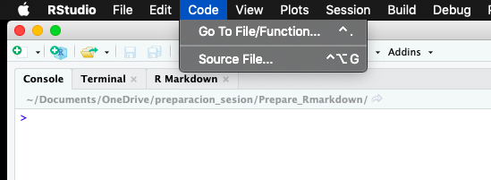
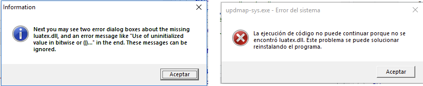

```{r setup, include=FALSE}
options(max.print=100)
library(knitr)
opts_chunk$set(echo = TRUE, message = F, warning = F, comment = NA, 
                      fig.align = 'center')
opts_knit$set(width=100)
```


### Introducción

El paquete [`rmarkdown`](https://vimeo.com/178485416) [@allaire2019] (y otros paquetes amigos) convierten el `R` y `RStudio` en un poderoso procesador de texto con la posibilidad de generar documentos dinámicos que mezclan el texto con scripts de código `R`, resultados (tablas, gráficas), imagenes, referencias cruzadas, bibliografía, etc., también con opción de múltiples tipos de salida (html, pdf, word, etc.) y diversos tipos de documento (informes, artículos, presentaciones, posters, libros, páginas web, blogs, etc.). Por ejemplo, este documento fue generado con `rmarkdown`.

En esta guía se describen los paquetes y programas (diferentes al `R` y `Rstudio`) que se deben instalar para usar las funciones de `rmarkdown`. Le recomendamos tomar en consideración esta guía dado que la instalación que se describe en seguida puede tomar entre  10 y 20 minutos dependiendo de la velocidad de internet y de las características de cada equipo.

Las actividades de instalación que deben revisarse son:

+ Instalar paquetes de `R`.
+ Actualizar `pandoc`.
+ Instalar `LaTeX` desde el paquete `tinytex` del `R`. `LaTeX` es requerido para producir salidas `pdf`.

### Instalar paquetes de `R`

Para instalar los paquetes de `R` requeridos realice los siguientes pasos (requiere conexión a internet):

1. Tenga a la mano el archivo `instale_rmarkdown.R` (descarguelo  [aquí](https://1drv.ms/u/s!AlLSvdV-Fwtugp0UIgpu0we5gRqh7g))
2. Abra el Rstudio. Vaya al menu `Code` -> `Source File ...` -> Busque y seleccione el archivo `instale_rmarkdown.R` y luego click en abrir (Figura \@ref(fig:source))

```{r source, echo = F, fig.cap='Ruta a la opción `Source File ...` en `Rstudio`', out.width='80%'}

```


3. Espere a que la instalación se ejecute (puede tomar unos 3 a 6 min). Se sabe que el proceso termino porque el prompt (`>`) vuelve a aparecer en la consola. 

Seguramente otros paquetes serán necesarios más adelante a medida que avance su aprendizaje, pero estos pueden ser instalados rapidamente cuando se requiera.


### Actualizar `pandoc`

El software `pandoc` es el que se encarga de realizar la conversión del documento `markdown` al formato del producto final (tal como `html`, `word`, `pdf`, etc.). Un versión de `pandoc` se instala con el `RStudio` pero al parecer no la más nueva. Sin embargo, algunas librerías requieren una versión actualizada de `pandoc`. Para preguntar por la versión que actualmente tenemos instalado podemos usar el siguiente comando (en la consola del `RStudio`):

```{r, echo = -3}
library(rmarkdown)  # se supone que ya descargo rmarkdown en el paso anterior
pandoc_version()
pandoc_version() -> pan.ver
```

A la fecha de este documento, la versión actual es la `r pan.ver`. Para actualizar `pandoc` realice los siguientes pasos:

1. Descargue la última versión de `pandoc` desde esta [página](https://pandoc.org/installing.html). El instalador es un  `.pkg` (19 MB) en Mac y un `.msi` (57 MB) en Windows. 
2. Ejecute el instalador y espere a que termine la instalación.
3. Si tenía el RStudio abierto durante la instalación, cierrelo, abralo de nuevo, y entonces, puede ejecutar la orden `pandoc_version()` (en la consola) para confirmar que la nueva versión fue reconocida.


### Instalación de LaTeX

[`LaTeX`](https://es.wikipedia.org/wiki/LaTeX) es un sistema de composición de textos, que permite escribir documentos desde texto plano, y esta orientado a la creación de documentos  que presenten una alta calidad tipográfica. Este programa lo usaremos para generar documentos en `pdf`.

Instalaremos una versión _reducida_ de `LaTeX` desde `R` usando  la librería `tinytex` (instalada en la sección anterior). Para esto, realice los siguientes pasos (requiere conexión a internet):

1. Tenga a la mano el archivo `instale_latex.R` (descarguelo [aquí](https://1drv.ms/u/s!AlLSvdV-Fwtugp0ORMvc_PSWrtwPDQ)).
2. Abra el Rstudio. Vaya al menu `Code` -> `Source File ...` -> Busque y seleccione el archivo `instale_latex.R` y luego click en abrir (Figura \@ref(fig:source)).
3. Espere a que la instalación se ejecute (puede tomar unos 3 a 15 min). Durante la instalación pueden salir un par de mensajes de error (Figura \@ref(fig:errores)). Dar **aceptar** a estos mensajes para continuar la instalación.

```{r errores, echo = F, fig.cap='Errores posibles que pueden aparecer durante la instalación de LaTeX al ejecutar el archivo `instale_latex.R`', out.width='90%'}

```

4. Se sabe que el proceso termino porque el prompt (`>`) vuelve a aparecer en la consola.


### Referencias


