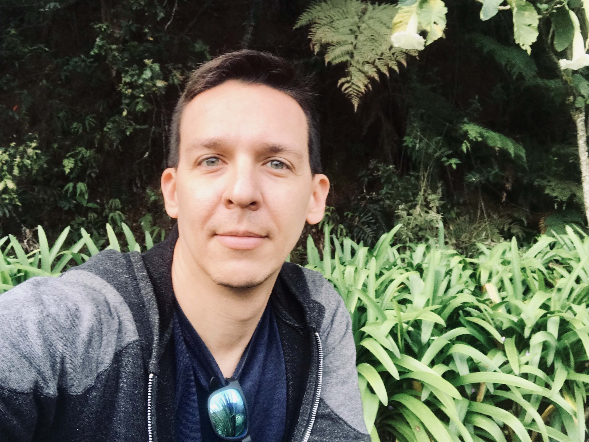

 
 

<link rel="stylesheet" href="styles.css" type="text/css">

Actualmente trabajo impartiendo cursos sobre _Bioestadística_. Mi interés se centra en la aplicación de métodos estadísticos para analizar datos en áreas biológicas y afines tales como modelos lineales generalizados, modelos mixtos, bootstrap, etc. 

De forma paralela, promuevo el uso de los software [`R`](https://www.r-project.org/) y [`RStudio`](https://www.rstudio.com/)  en tareas de programación computacional en Biología y su empleo para realizar manejo y análisis de datos y generación de documentos dinámicos desde [`Rmarkdown`](https://rmarkdown.rstudio.com/) y aplicaciones con [`Shiny`](http://shiny.rstudio.com/).

Este espacio web lo utilizo para publicar contenido (tutoriales, datos, links, etc.) sobre _estadística_, [`R`](https://www.r-project.org/) y aspectos relacionados que empleo en mis cursos, para facilitar a los estudiantes el acceso al material.

